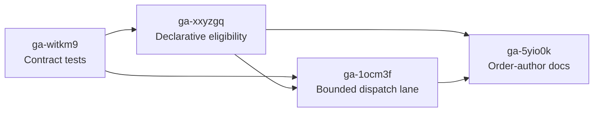

# Reserved order dispatch capacity

Root bead: `ga-ikt6e2`

## Outcome

Gas City will give three platform-supplied liveness probes a bounded dispatch
opportunity on every patrol tick without enlarging or consuming the ordinary
order budget:

- `beads-health` and `gate-sweep`, supplied by the built-in core pack
- `dolt-health`, supplied by the built-in Dolt provider pack

The capability is a single declarative reservation flag, not a priority
system. The three bundled definitions opt in by default. A patrol tick may
launch up to three reserved orders in addition to the ordinary
`orders.max_dispatches_per_tick` allowance.

Reservation changes budget selection only. It does not bypass trigger
evaluation, city or rig suspension, open-work policy, tracking and
single-flight behavior, timeouts, or failure recording.

## Why this work exists

The city currently has 90 auto-dispatchable orders and about 41 due orders at
any moment. With the default ordinary budget of four, one round-robin lap takes
11 patrol ticks. The three probes above are configured with 30-second
cooldowns but were measured at 65–99 minutes between runs.

Raising the ordinary budget cannot safely guarantee their cadence. Covering
all 41 due orders in one tick would require roughly ten times the default,
which would recreate the cold-start launch-burst risk that the bounded budget
was introduced to prevent. A narrow reserved lane protects foundational
liveness work while leaving the ordinary automation ring and its safety bound
intact.

The immediate city-level mitigation has already doubled the ordinary budget
from four to eight. That improves general automation latency but does not meet
the probe-liveness requirement, so this package remains necessary.

## Product contract

| Requirement | Acceptance boundary |
| --- | --- |
| Declarative eligibility | One binary order-definition declaration; omitted means ordinary dispatch. No Go branch recognizes literal order names. |
| Bundled defaults | Exactly `dolt-health`, `beads-health`, and `gate-sweep` opt in among bundled orders. |
| Separate bound | At most three reserved launches per tick, in addition to the configured ordinary budget. |
| No budget borrowing | Reserved launches do not consume ordinary slots; unused reserved slots do not enlarge the ordinary allowance. |
| Fair overflow | If more than three reserved orders are due, later ticks make progress fairly while each tick stays capped. |
| Gates preserved | Reservation bypasses only the ordinary budget cutoff. Every existing trigger, suspension, work-gate, tracking, timeout, and outcome rule stays in force. |
| Layering preserved | A higher-priority order definition remains a total replacement and must explicitly repeat the reservation declaration to retain eligibility. |
| Backward compatibility | Cities and packs with no reserved orders retain current dispatch behavior and ordinary-budget semantics. |

## Work graph

### 1. Contract tests — `ga-witkm9`

Routing: `needs-tests` → validator

The validator authors the failing behavioral contract before production code
changes. Coverage includes three reserved launches beside an exhausted
ordinary budget, ordinary-order budget enforcement, preserved gates, and
repeat-tick single-flight behavior. The test uses neutral order names so it
cannot normalize a name-based implementation.

### 2. Declarative eligibility — `ga-xxyzgq`

Routing: `ready-to-build` → builder  
Blocked by: `ga-witkm9`

The order model carries one reservation declaration through parsing,
validation, scanning, pack expansion, reload, and copy paths. The three
platform-supplied definitions opt in; other bundled definitions do not. This
increment changes no dispatch budget or gate behavior.

### 3. Bounded reserved dispatch — `ga-1ocm3f`

Routing: `ready-to-build` → builder  
Blocked by: `ga-witkm9`, `ga-xxyzgq`

The orchestrator gives due, gate-eligible reserved orders up to three
additional launches per tick. The ordinary round-robin allowance continues to
serve ordinary orders independently. Overflow remains fair and bounded, and
reload/shutdown behavior introduces no duplicate launch.

### 4. Order-author documentation — `ga-5yio0k`

Routing: `ready-to-build` → builder  
Blocked by: `ga-xxyzgq`, `ga-1ocm3f`

The order-author reference explains eligibility, both per-tick bounds, the
intended foundational-liveness use, preserved gates, and total-replacement
layering semantics. Generated reference material is changed only at its source.

Each bead contains the full measurable acceptance criteria; this artifact
records scope and sequencing rather than duplicating every test assertion.

## Dependencies and coordination

- `ga-c5se4z`, the independent doctor warning for unachievable cooldowns, does
  not block this package and should ship in parallel.
- `ga-451jnv` / PR #6068 addresses long patrol ticks. Faster ticks improve
  observed cadence but do not remove the shared-budget starvation mechanism,
  so it is not a dependency.
- The validator bead is the only unblocked implementation dependency at
  handoff. Later beads are routed now but remain blocked in the ledger until
  their prerequisites close.

## Risks and mitigations

| Risk | Mitigation |
| --- | --- |
| Pack authors treat reservation as general priority | Expose one binary concept, document the narrow liveness/recovery use, and retain a hard per-tick cap. |
| A local override silently loses reservation | Preserve existing total-replacement semantics and document that the declaration must be repeated. |
| Reserved work recreates a launch burst | Cap the lane at three and keep it independent of the operator-tunable ordinary budget. |
| Reservation accidentally bypasses safety gates | Contract tests cover suspension, open-work policy, trigger checks, and repeat-tick tracking independently from budget selection. |
| Provider assumptions leak into generic orchestration | Keep the Dolt opt-in in its provider pack definition; generic order and dispatcher paths understand only declarative eligibility. |

## Out of scope

- Auto-scaling either dispatch budget from ring size or host load
- Decoupling all order dispatch from the patrol tick
- Multiple priority levels, weighted scheduling, or preemption
- Changing `NoWorkGate`, open-work suppression, or suspension semantics
- Replacing the achievable-cooldown doctor work in `ga-c5se4z`
- Further city-level tuning of `orders.max_dispatches_per_tick`

## Completion signal

The package is complete when all four child beads are closed, the three bundled
probes are verified as reserved by default, a saturated ordinary ring cannot
delay their gate-eligible dispatch opportunity beyond the next patrol tick,
and ordinary dispatch remains bounded by the configured budget.
